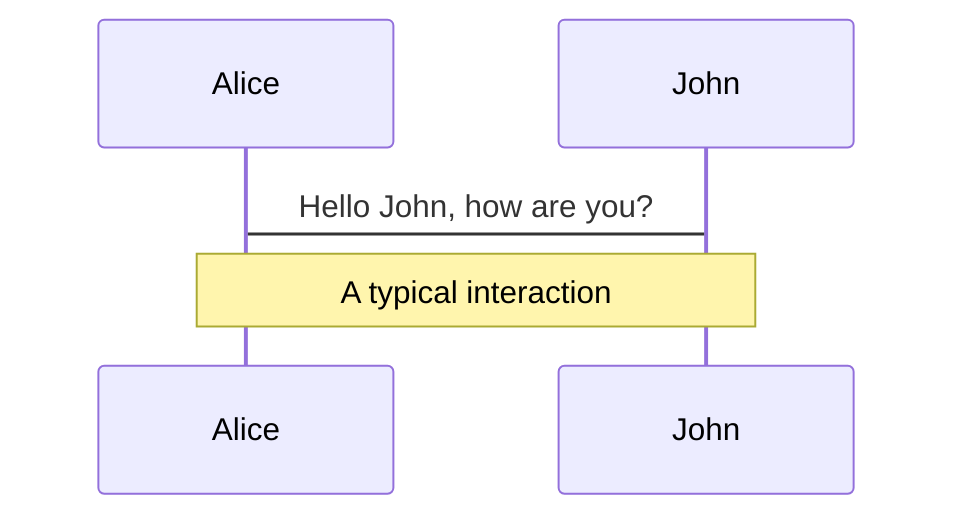
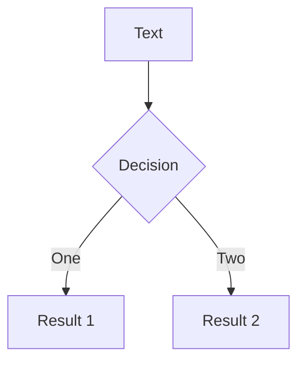

---
relates:
  - Mermaid: https://mermaid.js.org/
  - Mermaid Live Editor: https://mermaid.live/
  - Demo Slide: https://sli.dev/demo/starter/12
  - features/plantuml
tags: [diagram]
description: |
  使用 Mermaid 从文本描述创建图表。
---

# Mermaid 图表

你还可以在 Markdown 中使用 [Mermaid](https://mermaid.js.org/) 从文本描述创建图表。

标记为 `mermaid` 的代码块将被转换为图表，例如：

````md

````

你还可以传递一个选项对象来指定缩放和主题。对象的语法是 JavaScript 对象字面量，你需要为字符串添加引号（`'`），并在键之间使用逗号（`,`）。

````md

````

访问 [Mermaid 网站](https://mermaid.js.org/) 了解更多信息。
