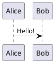

---
relates:
  - Plant UML: https://plantuml.com/
  - Plant UML Live Editor: https://plantuml.com/plantuml
  - Example side: https://sli.dev/demo/starter/12
  - features/mermaid
tags: [diagram]
description: |
  从文本描述创建图表，由 PlantUML 驱动。
---

# PlantUML 图表

你可以在幻灯片中轻松创建 PlantUML 图表，例如：

````md

````

默认情况下，源代码将发送到 https://www.plantuml.com/plantuml 来渲染图表。你也可以通过在 [Slidev 配置](../custom/index#headmatter)中设置 `plantUmlServer` 来搭建自己的服务器。

访问 [PlantUML 网站](https://plantuml.com/)了解更多信息。
